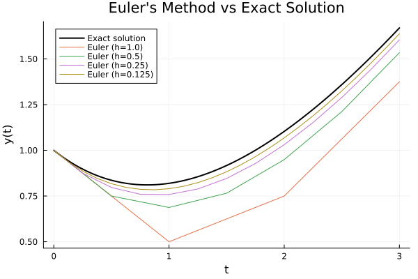

# 📐 Numerical Methods Solver in Julia
*A collection of ODE and BVP solvers using Euler, Predictor–Corrector, and Finite Element Methods.*

This repository contains my **Project 4 (MCS 472)** implementation of core numerical methods used to solve:

- Initial Value Problems (IVPs)
- Boundary Value Problems (BVPs)
- Nonlinear and linear differential equations

The project includes **Euler’s Method**, **Adams–Bashforth/Moulton Predictor–Corrector**, and a full **Finite Element Method (FEM)** framework with convergence analysis and error norms.

---

## 🚀 Features

### 🔹 1. Euler’s Method (IVP Solver)
- Implemented forward Euler with step sizes \( h = 1, 0.5, 0.25, 0.125 \)
- Compared numerical vs analytic solutions
- Demonstrated error reduction as \( h \to 0 \)
- Includes plots showing convergence behavior

### 🔹 2. Predictor–Corrector Method
- Two-step Adams–Bashforth + Euler predictor
- Adams–Moulton corrector
- Initialization via Trapezoidal Method
- Identified regions of divergence near \( t \approx 5 \)
- Achieved significantly improved accuracy compared to Euler

### 🔹 3. Finite Element Method (FEM) for BVPs
- Constructed global stiffness matrix \( K \), mass matrix \( M \), and load vector \( F \)
- Applied linear (hat) basis functions over mesh
- Solved multiple BVP cases, including:
  - \( -u'' = f \)
  - \( -u'' + u = f \)
- Computed error norms for meshes:
  - \( n = 10, 20, 40, 80, 160, 320, 640 \)

### 🔹 4. Convergence Analysis
- Generated **log–log error convergence plots**
- Verified **second–order convergence** for smooth problems
- Analyzed failure modes for more complex BVPs

---

## 📚 Folder Structure

---

## 📈 Example Plots

### Euler Method Convergence  
*(placeholder — add your PNG)*  

### FEM Log–Log Error Plot  
!(plots/fem_loglog.png)

---

## 🧠 Key Technical Skills Demonstrated
- Numerical ODE and BVP solving
- Finite Element Method implementation
- Matrix assembly and sparse linear algebra
- Error analysis (L2 norms, mesh refinement)
- Julia programming workflows
- Scientific plotting & model validation

---

## 🛠️ Tech Stack
- **Julia**
- `Plots.jl`, `LinearAlgebra`, `SparseArrays`
- Jupyter Notebook
- FEM math + numerical analysis foundations

---

## 📜 License
This project is for academic and educational use.

---

## 👤 Author
**Joseph Kang**  
University of Illinois Chicago  

